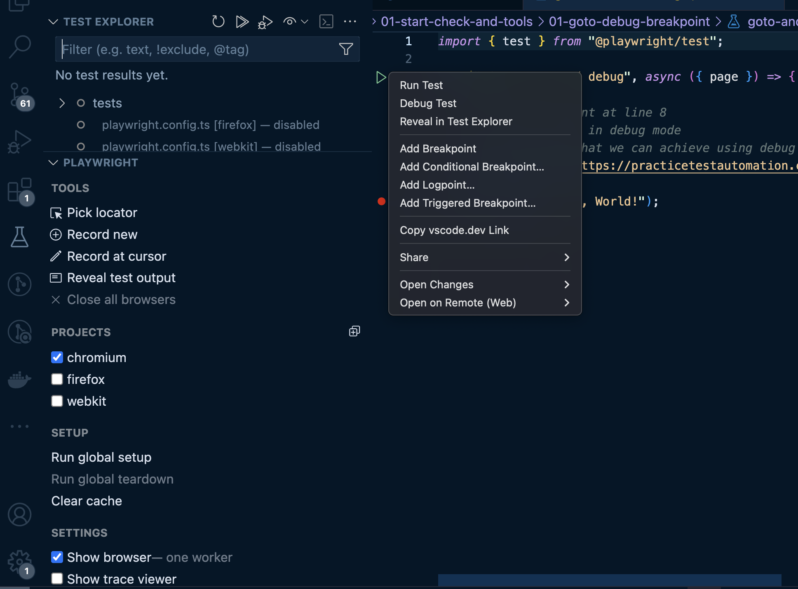

# Playwright with TypeScript exercises

All examples, exercises, and solutions can be found in the test directory. These resources are updated regularly.

The project is configured with both a linter and Prettier, which helps to avoid common mistakes when working with TypeScript and Playwright — such as forgetting to await promises when performing actions on pages ^^

## Requirements

Installed node v22 and npm. I recommend using [NVM](https://github.com/nvm-sh/nvm) to manage node versions.

Clone this repo and execute:

```bash
npm install
```

Then install [VSC](https://code.visualstudio.com/) with recommended extensions and open this repository in it.
VSC recommended extensions

- ms-playwright.playwright
- dbaeumer.vscode-eslint
- pkief.material-icon-theme
- streetsidesoftware.code-spell-checker
- mattpocock.ts-error-translator

After installation your VSC testing tab should look like this:


To check if linter works properly open this file: tests/01-start-check-and-tools/02-static-analysis-autoformat/static-analysis-autoformat.spec.ts

## Running tests

You can run Playwright tests using the following commands:

```bash
npx playwright test --ui

npx playwright test --grep "some test" --trace on

npx playwright test
```
